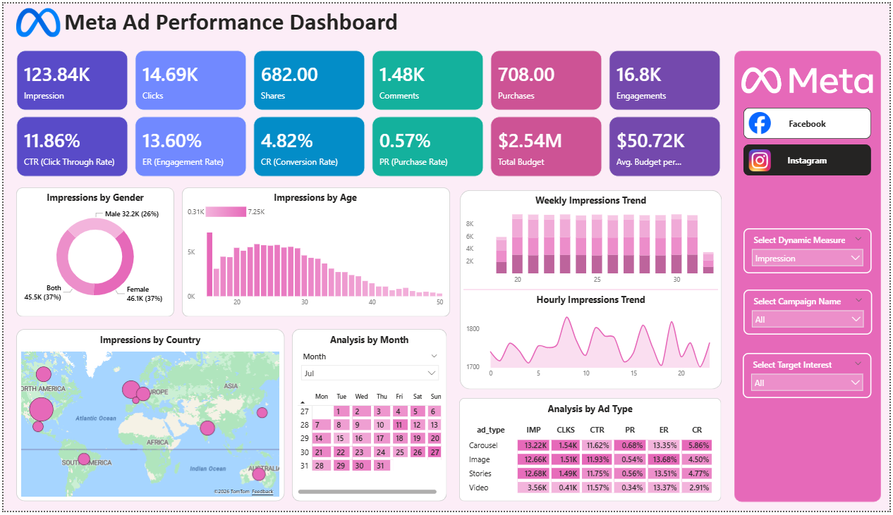
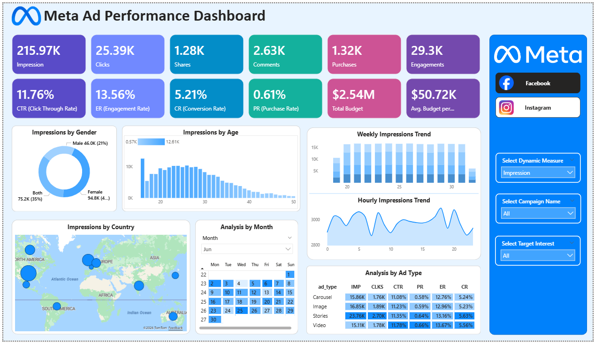

# Meta Ad Performance Dashboard (Power BI)

## 📌 Overview
The **Meta Ad Performance Dashboard** is an end-to-end аналитical solution built in **Microsoft Power BI** to monitor, analyze, and optimize advertising campaigns running on **Meta platforms (Facebook & Instagram)**.

The dashboard provides a unified view of **reach, engagement, conversions, audience behavior, budget utilization, and time-based trends**, enabling marketing teams to make informed, data-driven decisions.

---

## 🎯 Business Objective
The primary objective of this dashboard is to:
- Measure advertising performance across Meta platforms
- Identify high-performing audiences, geographies, and ad formats
- Assess the efficiency of the conversion funnel
- Optimize ad scheduling and budget allocation
- Support strategic marketing and campaign optimization decisions

---

## 📂 Scope
### ✅ In Scope
- Paid ad campaigns on **Facebook** and **Instagram**
- Audience engagement and conversion metrics
- Time-based and demographic performance analysis

### ❌ Out of Scope
- Organic engagement data
- Other Meta platforms (Messenger, Audience Network)

---

## 📊 Key KPIs
| KPI | Description |
|---|---|
| Impressions | Number of times ads were shown |
| Clicks | Number of ad clicks |
| Shares | Number of ad shares |
| Comments | Number of ad comments |
| Engagements | Clicks + Shares + Comments |
| CTR | Click-through rate (Clicks / Impressions) |
| Engagement Rate | Engagements / Impressions |
| Conversion Rate | Purchases / Clicks |
| Purchase Rate | Purchases / Impressions |
| Total Budget | Total ad spend |
| Avg Budget per Campaign | Average spend per campaign |

---

## Dashboard Preview

### Meta Ad Performance Dashboard


### Facebook Ad performance Dashboard


---

## 📈 Dashboard Features

### 🔹 KPI Overview
High-level performance summary highlighting:
- Reach, engagement, conversions
- Funnel efficiency metrics
- Budget visibility

### 🔹 Audience Insights
- **Gender Distribution** (Donut Chart)
- **Age Group Engagement** (Bar Chart)
- Key insight: Highest engagement from **Females aged 18–30**

### 🔹 Geographic Performance
- **Country-wise performance** using a map visual
- Bubble size represents selected metric
- Top geographies include **India, USA, Brazil, UK, and Germany**

### 🔹 Time-Based Analysis
- **Weekly Trends** (Stacked Column Chart)
- **Hourly Engagement Patterns** (Area Chart)
- Identifies peak performance windows (Afternoons & Evenings)

### 🔹 Calendar Heatmap
- Day-level performance tracking
- Highlights campaign spikes tied to promotions and launches

### 🔹 Ad Format Performance
- Matrix comparison across **Ad Types**
- Identifies **Video and Story ads** as top performers

---

## 🎨 Design Philosophy
- Clean **white background** for readability
- Consistent **brand-aligned color themes**
- KPI cards retain strong color identity
- Charts use subtle thematic shades for clarity
- Emphasis on **visual hierarchy over decoration**

Two theme variants are included:
- **Blue Theme** (Default / Corporate)
- **Pink Theme** (Alternative / Presentation-friendly)

---

## 🛠️ Tools & Technologies
- **Microsoft Power BI**
- Power Query (Data Transformation)
- DAX (Measures & Calculations)
- Meta Ads sample dataset

---

## 📁 Repository Structure
```bash
├── Dashboard/
│   ├── Meta Ad Performance Dashboard.pbix
│
├── Raw Data/
│   ├── ad_events.csv
│   ├── ads.csv
│   ├── campaigns.csv
│   ├── users.csv
|
├── Assets/
│   ├── Meta_Ad_Performace_Dashboard.png
│   ├── Facebook_Ad_Performace_Dashboard.png
│
└── README.md
```

---

## 🚀 Key Insights & Recommendations
- Strong **top-of-funnel performance** (high CTR & engagement)
- Weak **conversion efficiency**, indicating landing page or funnel gaps
- Best performing segments:
  - Females aged 18–30
  - Video & Story ad formats
  - India & USA as high-volume markets
- Recommended actions:
  - Optimize landing pages and retargeting
  - Increase spend on high-performing ad formats
  - Schedule campaigns during peak hours

---

## 👤 Author
**Jayendar A** 
